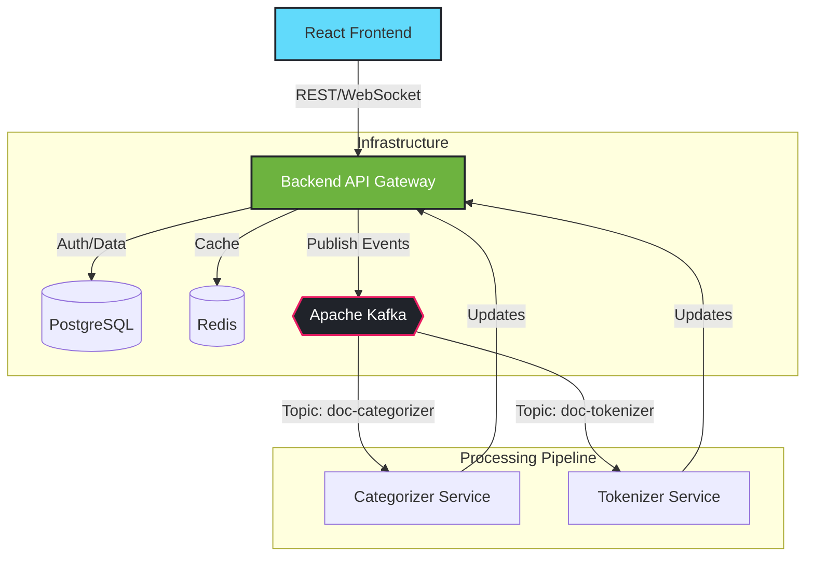

# Intelligent Document Processing (IDP) Pipeline

[](https://www.oracle.com/java/) 
[](https://spring.io/projects/spring-boot)
[](https://reactjs.org/)
[](https://www.docker.com/)
[](LICENSE)

An enterprise-grade intelligent document processing system built with a robust Spring Boot backend and React frontend. The platform automates the ingestion, validation, and processing of legal documents through a scalable, event-driven architecture powered by Apache Kafka.

---

## Table of Contents

- [Features](#-features)
- [Architecture](#-architecture)
- [Technology Stack](#-technology-stack)
- [Project Structure](#-project-structure)
- [Getting Started](#-getting-started)
- [Configuration](#-configuration)
- [Deployment](#-deployment)
- [API Reference](#-api-reference)
- [Contributing](#-contributing)
- [License](#-license)

---

## Features

*   **Secure Document Ingestion**: Upload documents with rigorous format and content validation using the Chain of Responsibility pattern.
*   **Event-Driven Processing**: Asynchronous processing pipeline utilizing Apache Kafka for high scalability and throughput.
*   **Intelligent Categorization**: Automatic document classification (Contracts, Legal Briefs, etc.) using content analysis.
*   **Real-Time Updates**: WebSocket integration providing live progress tracking to the frontend (Observer Pattern).
*   **Advanced Extraction**: Pluggable strategies for extracting text and metadata from PDF and DOCX files.
*   **Secure Architecture**: Complete RBAC system with JWT authentication and Spring Security.
*   **Observability**: Integrated Prometheus metrics and ELK stack logging for production-grade monitoring.

---

## Architecture

The system follows a reactive microservices-style architecture, decoupling ingestion from processing to handle high loads efficiently.



### Design Patterns
*   **Chain of Responsibility**: For flexible, ordered validation steps.
*   **Composite Pattern**: To represent complex, hierarchical document structures.
*   **Observer Pattern**: To push real-time status updates to clients.
*   **Strategy Pattern**: To swap extraction logic based on file type (PDF vs DOCX).

---

## Technology Stack

### Backend
*   **Framework**: Spring Boot 3.1.0
*   **Language**: Java 17
*   **Security**: Spring Security, JWT (JJWT)
*   **Messaging**: Spring Kafka
*   **Persistence**: Spring Data JPA, PostgreSQL
*   **Caching**: Redis
*   **Processing**: Apache PDFBox, Apache POI

### Frontend
*   **Framework**: React 18
*   **Language**: TypeScript
*   **State/Network**: Axios, React Hooks
*   **Styling**: CSS Modules / Standard CSS

### Infrastructure & DevOps
*   **Containerization**: Docker, Docker Compose
*   **Orchestration**: Kubernetes Manifests included
*   **Monitoring**: Spring Actuator, Prometheus (Micrometer)
*   **Logging**: ELK Stack ready

---

## Project Structure

```bash
intelligent-document-processing/
├── backend/                 # Spring Boot Application
│   ├── src/main/java/       # Source code
│   └── pom.xml              # Maven dependencies
├── frontend/                # React Application
│   ├── src/                 # Components and logic
│   └── package.json         # NPM dependencies
├── docker/                  # Dockerfiles for Prod/Dev
├── k8s/                     # Kubernetes deployment configuration
├── scripts/                 # Utility scripts (Load testing, etc.)
└── docker-compose.yml       # Local development stack
```

---

## Getting Started

### Prerequisites
*   **Java 17+**
*   **Node.js 16+** & **npm**
*   **Docker** & **Docker Compose**
*   **Maven 3.6+**

### Quick Start (Docker)
The easiest way to run the entire stack is via Docker Compose:

1.  **Clone the repository**
    ```bash
    git clone https://github.com/your-org/intelligent-document-processing.git
    cd intelligent-document-processing
    ```

2.  **Start Services**
    ```bash
    docker-compose up -d
    ```
    *This starts Postgres, Redis, Kafka, Zookeeper, and the Backend API.*

### Manual Local Development

#### 1. Start Infrastructure
Run the supporting services (ensure ports 5432, 6379, 9092 are free):
```bash
docker-compose up -d postgres redis kafka zookeeper
```

#### 2. Backend Setup
```bash
cd backend
mvn clean install
mvn spring-boot:run
```
*Server runs at `http://localhost:8080`*

#### 3. Frontend Setup
```bash
cd frontend
npm install
npm start
```
*Client runs at `http://localhost:3000`*

---

## Configuration

The application uses standard Spring Boot configuration. Key environment variables:

| Variable | Description | Default |
|----------|-------------|---------|
| `SPRING_DATASOURCE_URL` | PostgreSQL URL | `jdbc:postgresql://localhost:5432/docdb` |
| `KAFKA_BOOTSTRAP_SERVERS` | Kafka Brokers | `localhost:9092` |
| `REDIS_HOST` | Redis Host | `localhost` |
| `JWT_SECRET` | Security Key | *Change_Me_In_Production* |
| `APP_CORS_ORIGINS` | Allowed Origins | `http://localhost:3000` |

---

## API Reference

### Auth
*   `POST /api/auth/register` - Create new account
*   `POST /api/auth/login` - Authenticate and receive token

### Documents
*   `POST /api/documents/upload` - Multiplayer file upload
*   `GET /api/documents/{id}/status` - Check processing status
*   `GET /api/documents/download/{id}` - Retrieve processed file

---

## Contributing

1.  Fork the project
2.  Create your feature branch (`git checkout -b feature/AmazingFeature`)
3.  Commit your changes (`git commit -m 'Add some AmazingFeature'`)
4.  Push to the branch (`git push origin feature/AmazingFeature`)
5.  Open a Pull Request

---

## License

Distributed under the MIT License. See `LICENSE` for more information.
